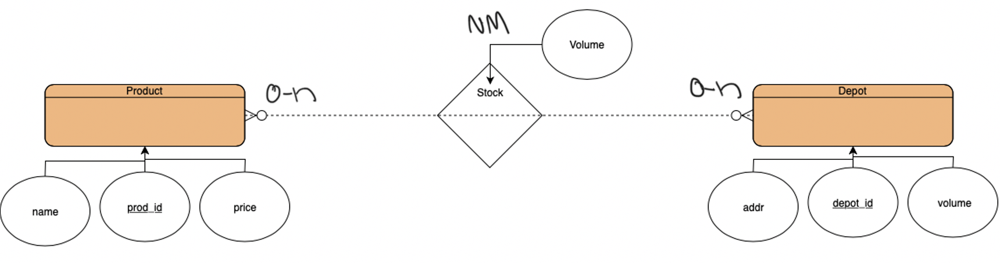

### CS3876232020
### Welcome to our CS 623 Java Project.

Objectives of the project

* Reverse Engineering the schema to an Entity Relationship Diagram (ERD).
* Developing a Java application using JDBC that connects to the PostgreSQL database.
* Coding a transaction in java that implements the ACID properties. ( Group 2 – The depot d1 is deleted from Depot and Stock)
* [For more information please go to the wiki](https://github.com/bhattavi/CS3876232020/wiki/Database-Project)

### ERD of Product, Stock, and Depot relations
  

Deliverables

* [Presentation Slides](https://docs.google.com/presentation/d/11QnvCmhk8FiNOp9CRXfIyAlhApet7oEmFFlo6x6ZZAo/edit#slide=id.p)
* [GitHub Repo Link](https://github.com/bhattavi/CS3876232020)
* [Code](https://github.com/bhattavi/CS3876232020/blob/master/javasql/src/javasql/SqlAcid.java)
* [Video](https://www.youtube.com/watch?v=Gh8teAom_lE)

